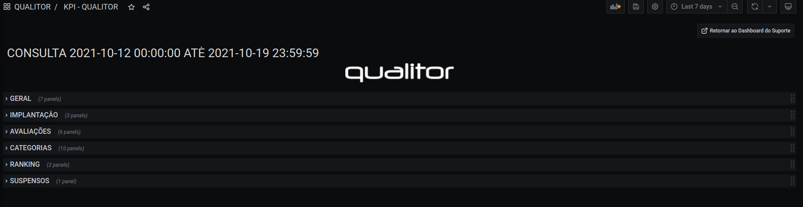
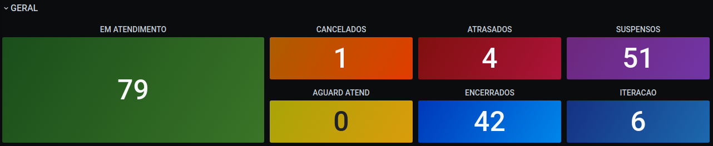
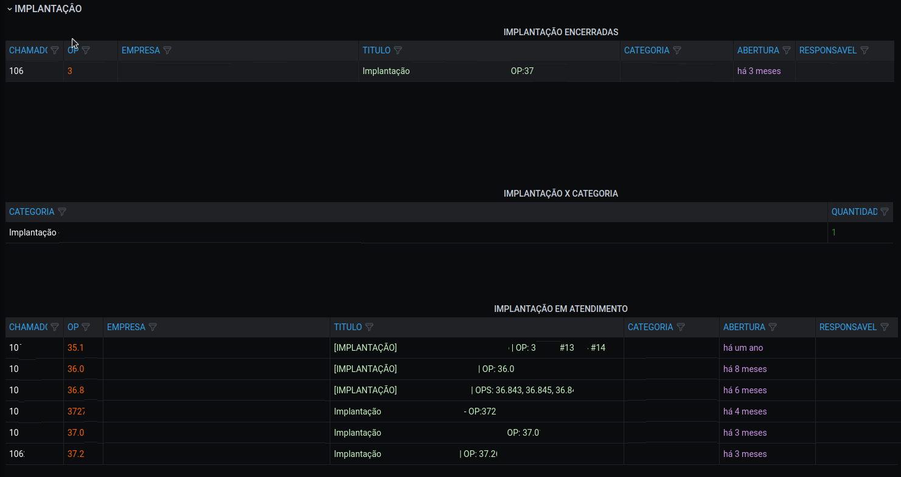
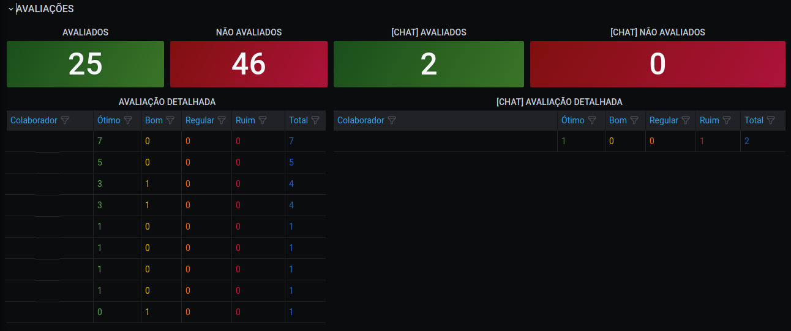
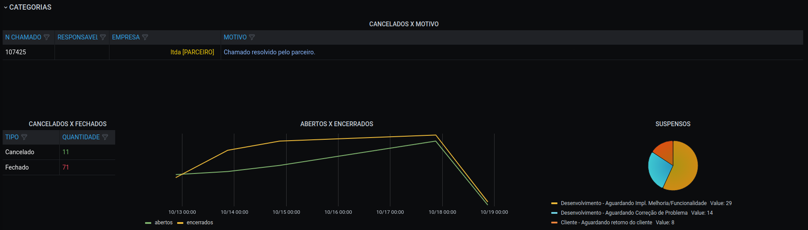
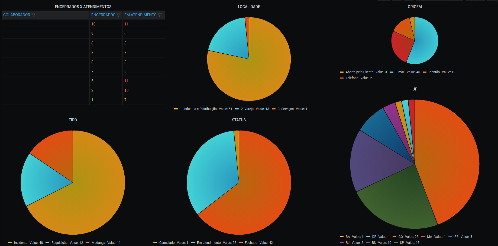
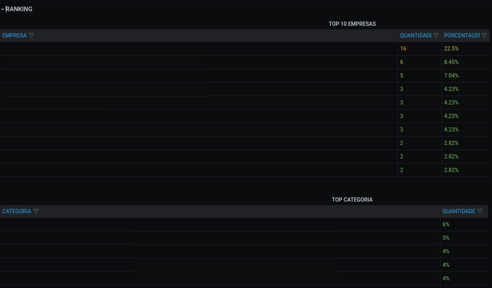
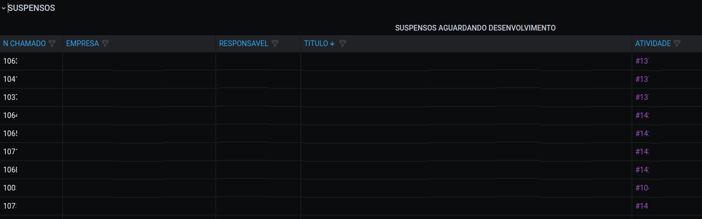

# QUALITOR DASHBOARD

 
   

Este **Dashboard** realiza a consulta no banco de dados do Qualitor para retornar alguns valores estratégicos utilizando o filtro de data do Grafana.

This **Dashboard** performs database query into Qualitor Data Base to return strategic data using time filter of Grafana.

#### A Versão 2.0 do dashboard foi separado nas seguintes ROWS para organização

* [**MAIN**](#MAIN)
* [**GERAL**](#GENERAL/GERAL)
* [**IMPLANTACAO**](#IMPLEMENTATION/IMPLEMENTAÇÃO)
* [**AVALIAÇÔES**](#RATING/AVALIAÇÔES)
* [**CATEGORIAS**](#CATEGORY/CATEGORIAS)
* [**RANKING**](#RANKING)
* [**SUSPENSOS**](#RANKING/SUSPENDED)

#### Version 2.0 of the dashboard has been separated into the following ROWS for organization

* [**GENERAL**](#GENERAL/GERAL)
* [**IMPLEMENTATION**](#IMPLEMENTATION/IMPLEMENTAÇÃO)
* [**RATING**](#RATING/AVALIAÇÔES)
* [**CATEGORY**](#CATEGORY/CATEGORIAS)
* [**RANKING**](#RANKING)
* [**SUSPENDED**](#RANKING/SUSPENDED)

## <a name="main">MAIN</a>

 Esses paineis retornam infornações básicas de:

* Quantidade de Tickets Avaliados
* Quantidade de Tickets Não Avaliados
* Quantidade de Tickets CHAT Avaliados
* Quantidade de Tickets CHAT Não Avaliados
* Quantidade de Tickets Encerrados
* Quantidade de Tickets Canceladosname

 These panels return basic information on:

* Number of Evaluated Tickets
* Number of Unrated Tickets
* Number of Rated CHAT Tickets
* Number of Unrated CHAT Tickets
* Number of Closed Tickets
* Number of Canceled Tickets

### <a name="GENERAL-GERAL">GENERAL/GERAL</a>

 Será apresentados os dados atuais por quantidade de Tickets nas seguintes categorias:
 
 Esses paineis retornam infornações básicas de:

* Quantidade de Tickets Abertos x Encerrados
* Quantidade de Avaliação dos Tickets ou Chat Tickets por Colaborador

  * EM ATENDIMENTO
  * CANCELADOS
  * ATRASADOS
  * SUSPENSOS
  * AGUARDANDO ATENDIMENTO
  * ENCERRADOS
  * ABERTOS COM ITERAÇÂO

 Will present the current data by number of Tickets in the following categories:

* Number of Open x Closed Tickets
* Quantity of Ticket or Chat Ticket Evaluation by Employee

  * IN SERVICE
  * CANCELED
  * DELAYED
  * SUSPENDED
  * WAITING FOR SERVICE
  * CLOSED
  * OPEN WITH ITERATION

### <a name="implementation-implantação">IMPLEMENTATION/IMPLANTAÇÂO</a>

 Esses paineis retornam infornações básicas de:

* Quantidade de Ticket x Empresa

 Será apresentados os dados das implantações divididos em:

  * ENCERRADOS
  * CATEGORIA
  * EM ATENDIMENTO
  * 
* Number of Ticket x Company

Current deployment data will be presented divided into:

  * CLOSED
  * CATEGORY
  * IN SERVICE

### <a name="rating-avaliações">RATING/AVALIAÇÔES</a>

 Será apresentados os das avaliações divididos em:

 Tanto como para tickets normais e para abertos via chat e seu detalhamento por quantidade divididos pela sua categoria

  * AVALIADOS
  * NÂO AVALIADOS

Current evaluation data will be presented, divided into:

 As for normal tickets and for open tickets via chat and their breakdown by quantity divided by their category

  * ASSESSED
  * NOT ASSESSED

### <a name="category-categoria">CATEGORY/CATEGORIAS</a>

 Será apresentados os dados das categorias divididos em:

 Tanto como para tickets normais e para abertos via chat e seu detalhamento por quantidade divididos pela sua categoria

  * AVALIADOS
  * NÂO AVALIADOS

Current category data will be presented, divided into:

 As for normal tickets and for open tickets via chat and their breakdown by quantity divided by their category

  * ASSESSED
  * NOT ASSESSED

### <a name="ranking">RANKING</a>

 Será apresentados os dados de ranking:

  * TOP 10 EMPRESAS POR QUANTIDADE
  * TOP CATEGORIAS DE TICKET

Ranking data will be displayed:

  * TOP 10 COMPANIES BY AMOUNT
  * TOP TICKET CATEGORIES

### <a name="suspended-suspensos">SUSPENDED/SUSPENSOS</a>

 Será apresentados os dados dos chamados suspensos em uma tabela, pegando o número da atividade (REDMINE) inserida no titulo do chamado começando com #

The suspended ticket data will be presented in a table, taking the activity number (REDMINE) inserted in the ticket title starting with #

