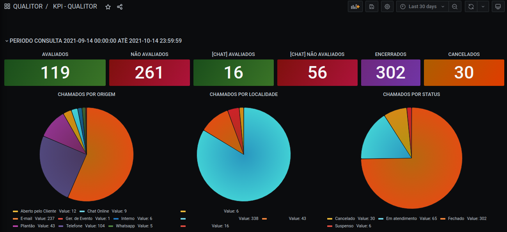
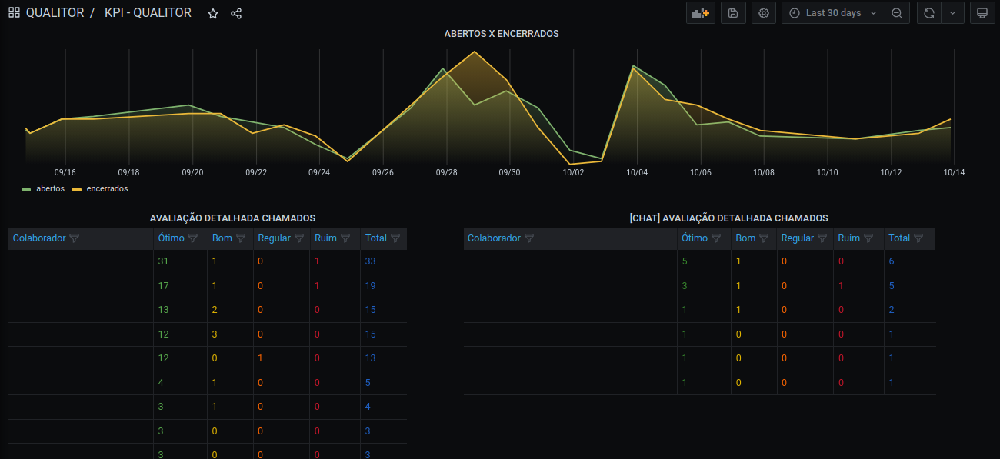
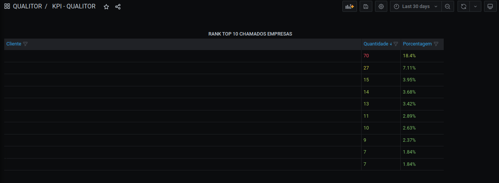
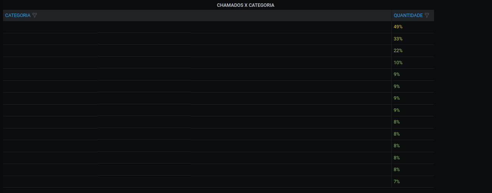

# QUALITOR DASHBOARD

Este Dashboard realiza a consulta no banco de dados do Qualitor para retornar alguns valores estratégicos utilizando o filtro de data do Grafana.

This dashboard performs database query into Qualitor Data Base to return strategic data using time filter of grafana.

1)
    Esses paineis retornam infornações básicas de:

- Quantidade de Tickets Avaliados
- Quantidade de Tickets Não Avaliados
- Quantidade de Tickets CHAT Avaliados
- Quantidade de Tickets CHAT Não Avaliados
- Quantidade de Tickets Encerrados
- Quantidade de Tickets Cancelados

    These panels return basic information on:

- Number of Evaluated Tickets
- Number of Unrated Tickets
- Number of Rated CHAT Tickets
- Number of Unrated CHAT Tickets
- Number of Closed Tickets
- Number of Canceled Tickets

2)
    Esses paineis retornam infornações básicas de:

- Quantidade de Tickets Abertos x Encerrados
- Quantidade de Avaliação dos Tickets ou Chat Tickets por Colaborador

    These panels return basic information on:

- Number of Open x Closed Tickets
- Quantity of Ticket or Chat Ticket Evaluation by Employee

3)
    Esses paineis retornam infornações básicas de:

- Quantidade de Ticket x Empresa

    These panels return basic information on:

- Number of Ticket x Company

4)
    Esses paineis retornam infornações básicas de:

- Quantidade de Ticket x Categoria

    These panels return basic information on:

- Number of Ticket x Category

